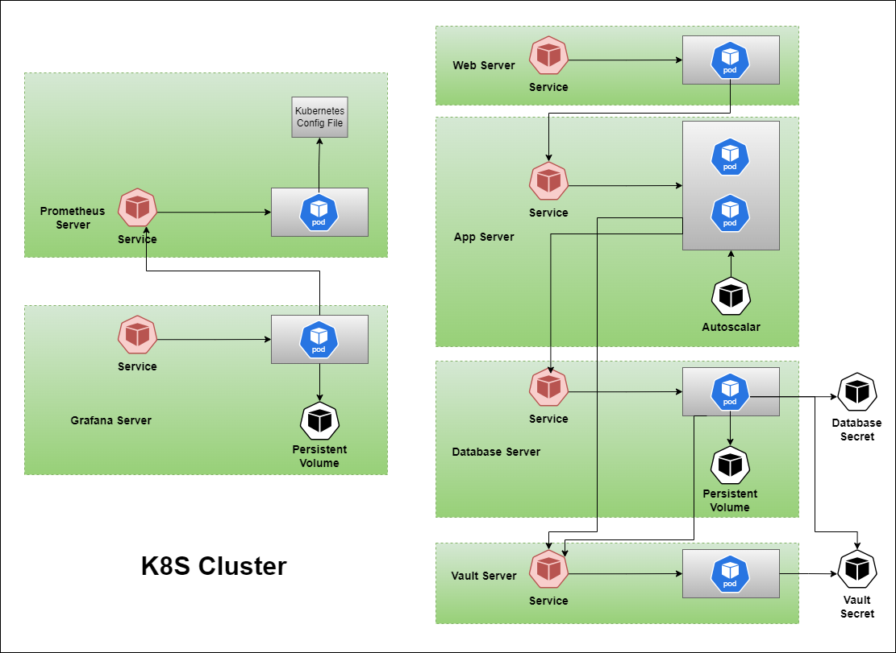
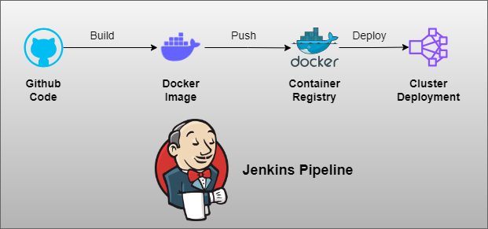

# iSolution
This project to deploy a Kubernetes cluster on GCP. And automate app deployment using Jenkins and Helm.

1. [Build GCP Infrastructure](terraform/README.md)
2. [Build/Test App Image](docker/App/README.md)
3. [Build MySql Image](docker/database/README.md)
4. [Build Prometheus Image](docker/prometheus/README.md)
5. [Build Nginx Image](docker/web/README.md)
6. [Build/Test Kubernetes](k8s/README.md)
7. [Helm Chart of App deployment](helm/README.md)

## Architecture

## Jenkins Pipelines
1. [Build App pipeline](docker/App/Jenkinsfile)
2. [Deploy new App pipeline](Jenkinsfile)

